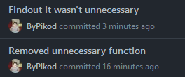

<!-- Introduction -->

  

<h1 align="center">Welcome to my profile</h1>

  

     
    Hello, I am <b>Pikod</b>. My real name is <b>Yahya</b>. I live in <b>Denizli, Turkey</b>
     I was born in 2005 and I have been improving myself at programming since I was 12 years old.
     These are some of my social media accounts that you can get contact with me:
  

  

    
    
    
     
    
    
    
  

 

<!-- Statistics -->

<h1 align="center">Statistics</h1>

    
  
  <h2></h2> 

  
   
   
      

<!-- Languages -->

<h1 align="center">Languages</h1>
 

   
  
  

    <!--<b>Since 1.12.2023</b>-->
    <b>Since 14.10.2023</b>
  
  

<!-- Abilities -->

<h1 align="center">Abilities</h1>

  Claiming to have an ability to something may have a different meaning for each individual.
  To avoid confusion, I should mention that the following tools and equipment are items I have used in at least one of my projects.

<h6 align="center">Programming Languages</h6>

  

<h6 align="center">Front End</h6>

  

<h6 align="center">Back End</h6>

  
  <!-- also: swagger -->

<h6 align="center">Web</h6>

  

<h6 align="center">DevOps</h6>

  
  <!-- also: trello -->

<h6 align="center">Other Tools</h6>

  

<h6 align="center">Design Tools</h6>

  

<h6 align="center">Databases</h6>

  

  

<!-- Projects -->

<h1 align="center">Open Source</h1>
 

  

  
  

<!-- Funny 

<h1 align="center">Funny</h1>
 

  

-->
  
<!-- Footer -->

<h1 align="center">Thanks for visiting!</h1>

  Thank You for Exploring My GitHub Profile! I appreciate your visit and interest in my work.
   
  <a href="/CREDITS.md">Click to see Credits</a>
    
   
  <!---->

